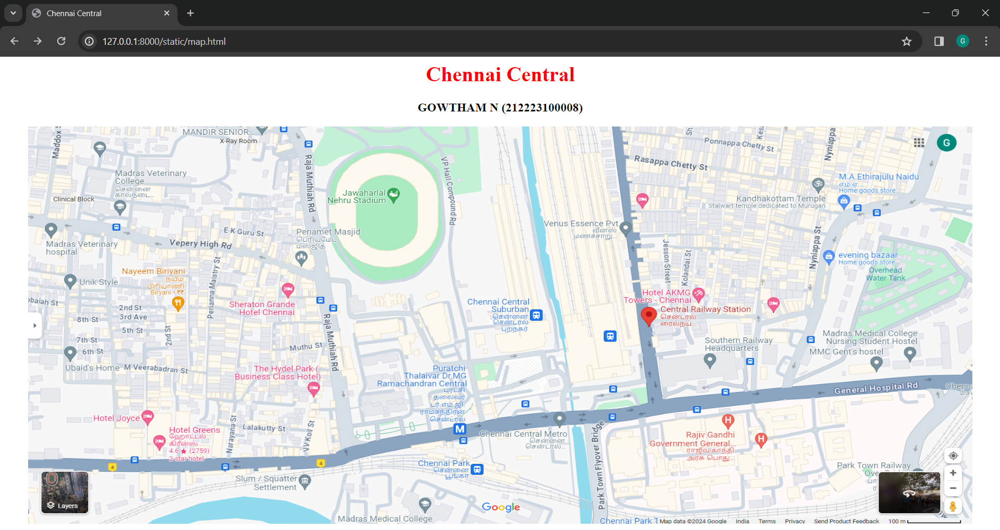
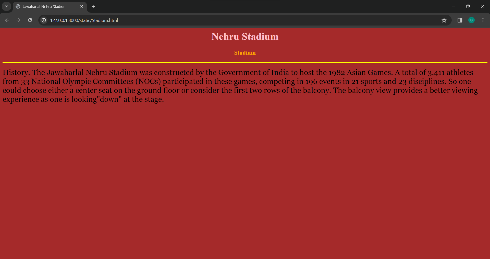
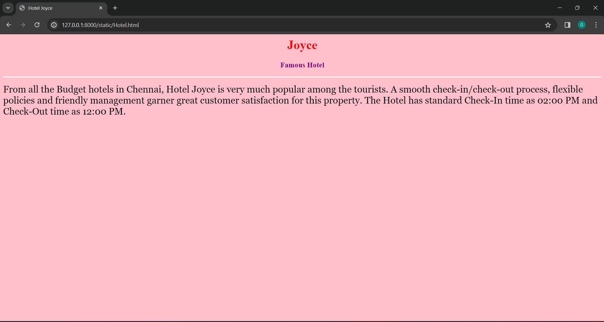
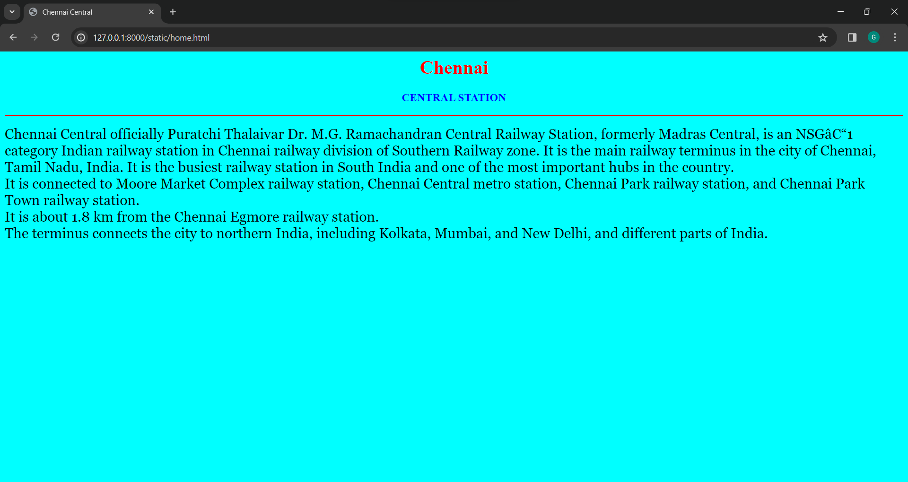
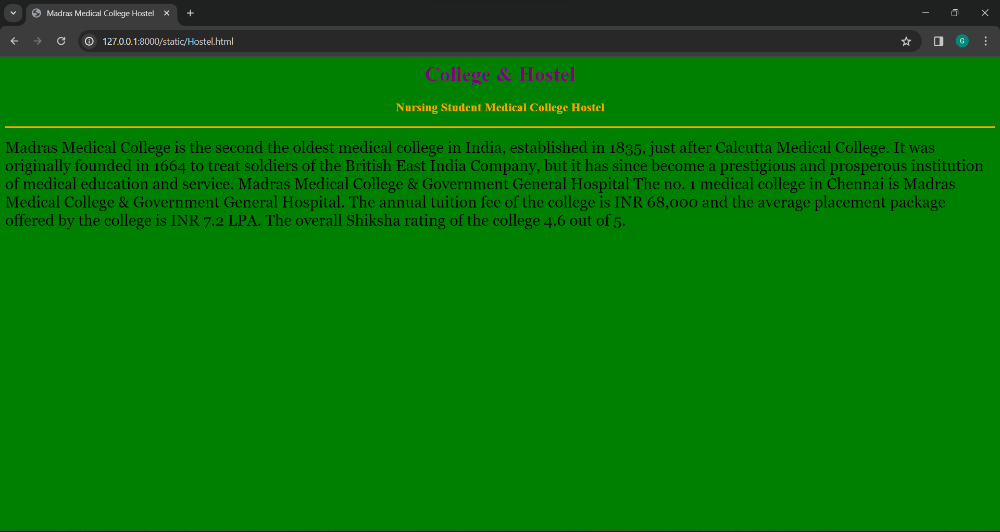
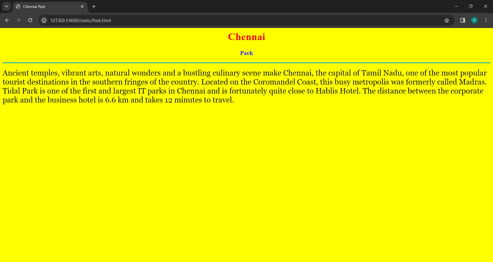
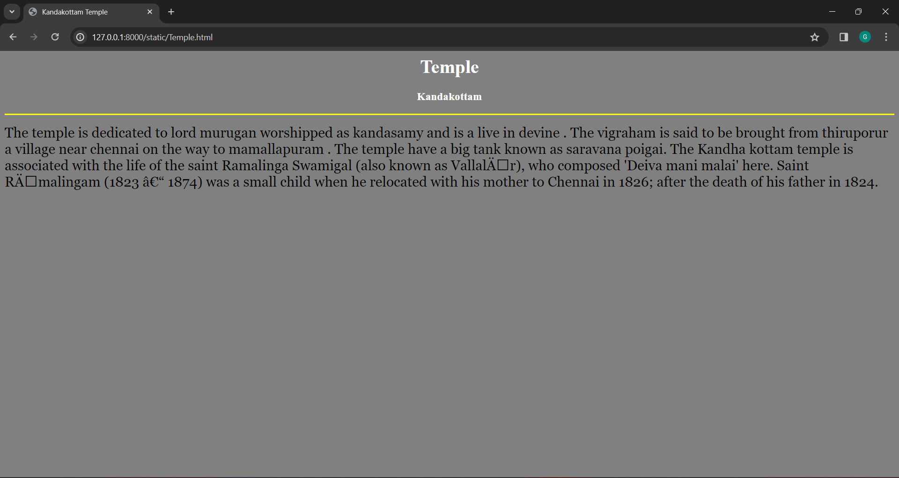

# Ex04 Places Around Me
## Date: 27-03-2024

## AIM
To develop a website to display details about the places around my house.

## DESIGN STEPS

### STEP 1
Create a Django admin interface.

### STEP 2
Download your city map from Google.

### STEP 3
Using ```<map>``` tag name the map.

### STEP 4
Create clickable regions in the image using ```<area>``` tag.

### STEP 5
Write HTML programs for all the regions identified.

### STEP 6
Execute the programs and publish them.

## CODE
```
map.html

<html>
    <head>
        <title>
            Chennai Central
        </title>
    </head>
    <body>
        <h1 align="center">
            <font color="red"><b>Chennai Central</b></font>
        </h1>
        <h3 align="center">
            <font color="black"><b>GOWTHAM N (212223100008)</b></font>
        </h3>
        <center>
            
            <map name="MyCity">
                <area shape="rect" coords="805,162,1226,539" href="home.html" title="My Home Town">
                <area shape="circle" coords="564,8,238" href="Stadium.html" title="Jawaharlal Nehru Stadium">
                <area shape="circle" coords="684,446,103" href="Park.html" title="Chennai Park">
                <area shape="circle" coords="1317,133,142" href="Temple.html" title="Kandakottam Temple">
                <area shape="circle" coords="216,462,128" href="Hotel.html" title="Hotel Joyce">
                <area shape="circle" coords="1337,467,273" href="Hostel.html" title="Madras Medical College Hostel">

            </map>
        </center>
    </body>
</html>

home.html

<html>
    <head>
        <title>Chennai Central</title>
    </head>
    <body bgcolor="cyan">
    <h1 align="center">
        <font color="red"><b>Chennai</b></font>
    </h1>
    <h3 align="center">
        <font color="blue"><b>CENTRAL STATION</b></font>
    </h3>
    <hr size="3" color="red">
    <p align="justified">
        <font face="Georgia" size="5">
            Chennai Central officially Puratchi Thalaivar Dr. M.G. Ramachandran Central Railway Station, formerly Madras Central, is an NSG–1 category Indian railway station in Chennai railway division of Southern Railway zone. It is the main railway terminus in the city of Chennai, Tamil Nadu, India. It is the busiest railway station in South India and one of the most important hubs in the country.
            <br> It is connected to Moore Market Complex railway station, Chennai Central metro station, Chennai Park railway station, and Chennai Park Town railway station.
            <br> It is about 1.8 km  from the Chennai Egmore railway station.
            <br> The terminus connects the city to northern India, including Kolkata, Mumbai, and New Delhi, and different parts of India.
        </font>
    </p>

    </body>
</html>

Hostel.html

<html>
    <head>
        <title>Madras Medical College Hostel</title>
    </head>
    <body bgcolor="green">
    <h1 align="center">
        <font color="purple"><b>College & Hostel</b></font>
    </h1>
    <h3 align="center">
        <font color="orange"><b>Nursing Student Medical College Hostel</b></font>
    </h3>
    <hr size="3" color="orange">
    <p align="justified">
        <font face="Georgia" size="5">
            Madras Medical College is the second the oldest medical college in India, established in 1835, just after Calcutta Medical College.
            It was originally founded in 1664 to treat soldiers of the British East India Company, but it has since become a prestigious and prosperous institution of medical education and service.
            Madras Medical College & Government General Hospital
            The no. 1 medical college in Chennai is Madras Medical College & Government General Hospital. The annual tuition fee of the college is INR 68,000 and the average placement package offered by the college is INR 7.2 LPA. The overall Shiksha rating of the college 4.6 out of 5.
        </font>
    </p>

    </body>
</html>

Park.html

<html>
    <head>
        <title>Chennai Park</title>
    </head>
    <body bgcolor="yellow">
    <h1 align="center">
        <font color="red"><b>Chennai</b></font>
    </h1>
    <h3 align="center">
        <font color="blue"><b>Park</b></font>
    </h3>
    <hr size="3" color="green">
    <p align="justified">
        <font face="Georgia" size="5">
            Ancient temples, vibrant arts, natural wonders and a bustling culinary scene make Chennai, the capital of Tamil Nadu, one of the most popular tourist destinations in the southern fringes of the country.
            Located on the Coromandel Coast, this busy metropolis was formerly called Madras.
            Tidal Park is one of the first and largest IT parks in Chennai and is fortunately quite close to Hablis Hotel. 
            The distance between the corporate park and the business hotel is 6.6 km and takes 12 minutes to travel.

        </font>
    </p>

    </body>
</html>


Stadium.html

<html>
    <head>
        <title>Jawaharlal Nehru Stadium</title>
    </head>
    <body bgcolor="brown">
    <h1 align="center">
        <font color="pink"><b>Nehru Stadium</b></font>
    </h1>
    <h3 align="center">
        <font color="orange">Stadium<b></b></font>
    </h3>
    <hr size="3" color="yellow">
    <p align="justified">
        <font face="Georgia" size="5">
            History. The Jawaharlal Nehru Stadium was constructed by the Government of India to host the 1982 Asian Games.
            A total of 3,411 athletes from 33 National Olympic Committees (NOCs) participated in these games, competing in 196 events in 21 sports and 23 disciplines.
            So one could choose either a center seat on the ground floor or consider the first two rows of the balcony.
            The balcony view provides a better viewing experience as one is looking"down" at the stage.
            
        </font>
    </p>

    </body>
</html>

Temple.html

<html>
    <head>
        <title>Kandakottam Temple</title>
    </head>
    <body bgcolor="grey">
    <h1 align="center">
        <font color="white"><b>Temple</b></font>
    </h1>
    <h3 align="center">
        <font color="white"><b>Kandakottam</b></font>
    </h3>
    <hr size="3" color="yellow">
    <p align="justified">
        <font face="Georgia" size="5">
            The temple is dedicated to lord murugan worshipped as kandasamy and is a live in devine .
            The vigraham is said to be brought from thiruporur a village near chennai on the way to mamallapuram .
            The temple have a big tank known as saravana poigai.
            The Kandha kottam temple is associated with the life of the saint Ramalinga Swamigal (also known as Vallalār), who composed 'Deiva mani malai' here.
            Saint Rāmalingam (1823 – 1874) was a small child when he relocated with his mother to Chennai in 1826; after the death of his father in 1824.
            
        </font>
    </p>

    </body>
</html>

```

## OUTPUT







## RESULT
The program for implementing image maps using HTML is executed successfully.
